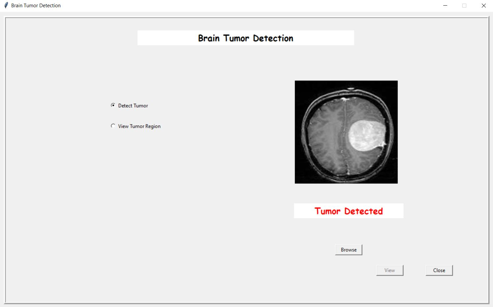
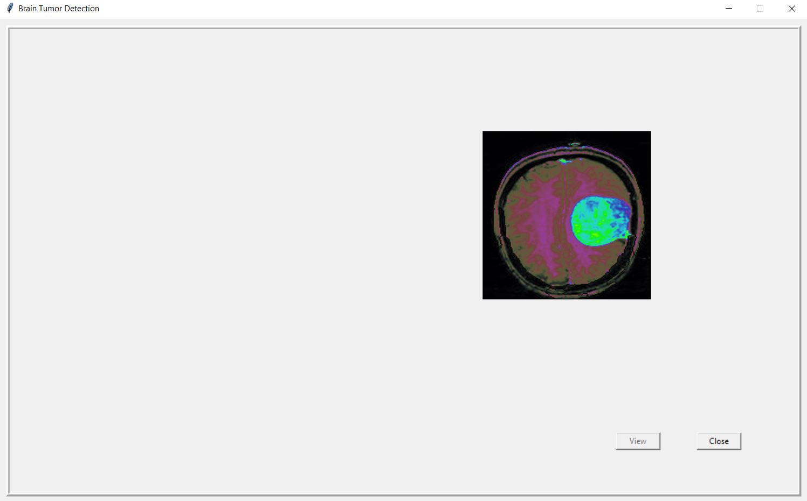

# 🧠 Brain Tumor Detection

A deep learning-based brain tumor detection system using **TensorFlow/Keras CNN** for MRI image classification and **OpenCV watershed segmentation** for tumor region visualization, wrapped in an interactive Tkinter GUI.


---

## ✨ Features

- **CNN-Based Tumor Detection** — Deep learning model trained to classify MRI images as tumor/no-tumor
- **Tumor Region Visualization** — Marker-based watershed segmentation to highlight and display the tumor region
- **Interactive GUI** — User-friendly Tkinter interface for uploading MRI images and viewing results
- **Symptom Reference** — Built-in brain tumor symptom information module
- **Image Processing Pipeline** — Noise removal, thresholding, morphological operations, and contour detection

## 📸 Screenshots

### Tumor Detection Interface


### Tumor Region Visualization


## 🚀 Quick Start

### Prerequisites
- Python 3.8+
- pip

### Installation

```bash
# Clone the repository
git clone https://github.com/SneaKy17/brain-tumor-detection.git
cd brain-tumor-detection

# Install dependencies
pip install -r requirements.txt
```

### Run the Application

```bash
python gui.py
```

### How to Use
1. Click **"Upload Image"** to select an MRI scan (JPG/PNG)
2. Select **"Detect Tumor"** to classify the image
3. Select **"View Tumor Region"** to visualize the segmented tumor area
4. Click **"Symptoms"** to view brain tumor symptom information

## 📁 Project Structure

```
brain-tumor-detection/
├── gui.py                      # Main application with Tkinter GUI
├── predictTumor.py             # CNN model prediction logic
├── displayTumor.py             # Image processing & tumor display
├── frames.py                   # GUI frame management
├── design.py                   # UI design components
├── tumorsymptoms.py            # Tumor symptoms information module
├── brain_tumor_detector.h5     # Pre-trained CNN model weights
├── requirements.txt            # Python dependencies
├── LICENSE                     # MIT License
└── README.md                   # This file
```

## 🔬 Technical Details

### Deep Learning Model
- **Architecture**: Convolutional Neural Network (CNN)
- **Framework**: TensorFlow/Keras
- **Input**: MRI brain scan images
- **Output**: Binary classification (Tumor / No Tumor)
- **Model File**: `brain_tumor_detector.h5`

### Image Processing Pipeline (Tumor Visualization)
1. **Grayscale Conversion** — Convert MRI to grayscale
2. **Noise Removal** — Gaussian blur and morphological operations
3. **Thresholding** — Otsu's adaptive thresholding
4. **Contour Detection** — Find tumor boundary contours
5. **Watershed Segmentation** — Marker-based watershed algorithm to precisely delineate tumor regions
6. **Overlay Visualization** — Highlight tumor region on original image

### Watershed Segmentation
The tumor region is visualized using marker-based watershed segmentation:
- Sure foreground and background regions are identified using distance transforms
- Unknown regions are labeled with markers
- OpenCV's watershed algorithm segments the tumor boundary with pixel-level precision

## 🛠️ Tech Stack

| Category | Technology |
|----------|-----------|
| Language | Python 3.8+ |
| Deep Learning | TensorFlow, Keras |
| Computer Vision | OpenCV |
| Image Processing | PIL/Pillow |
| GUI Framework | Tkinter |
| Data Handling | NumPy |

## 📝 License

This project is open source and available under the [MIT License](LICENSE).

## 🤝 Contributing

Contributions are welcome! Feel free to open issues or submit pull requests.

---

*Built by [Nikhil Saklani](https://github.com/SneaKy17)*